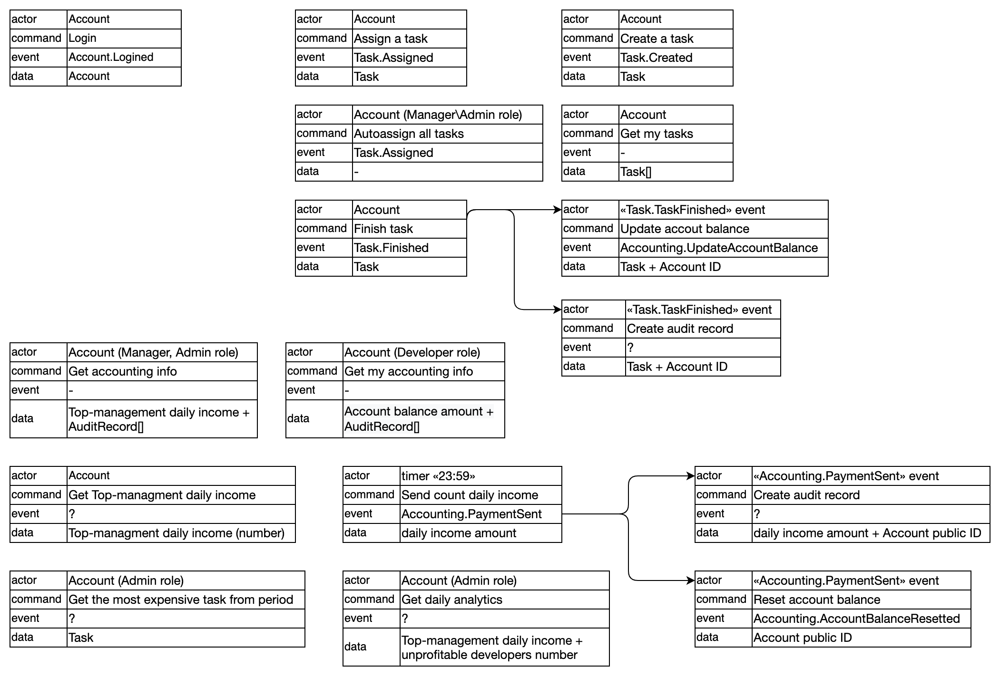
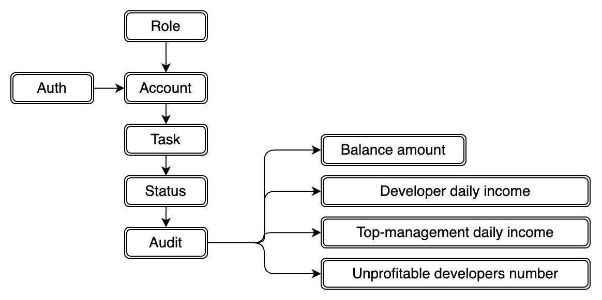
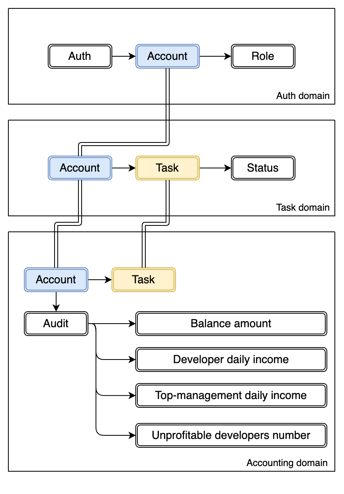
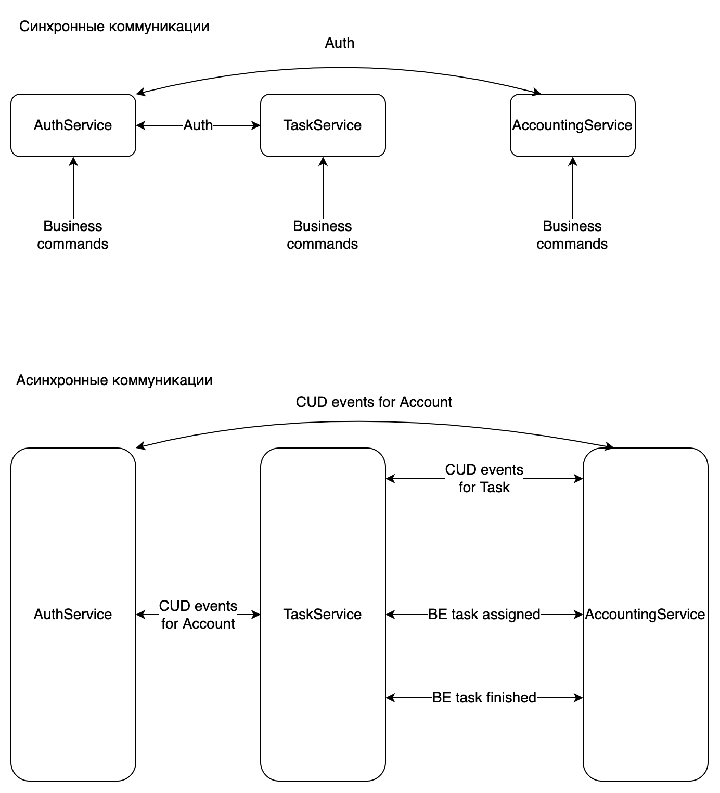

1. Разобрать каждое требование на составляющие.

 1. Построить модель данных для системы и модель доменов.

 
   
 2. Определить, какие общие данные нужны для разных доменов и как связаны данные между разными доменами.

 

 3. Разобраться, какие сервисы, кроме тудушника, будут в нашей системе и какие между ними могут быть связи (как синхронные, так и асинхронные).

 

 4. Определить все бизнес события, необходимые для работы системы. Отобразить кто из сервисов является продьюсером, а кто консьюмером бизнес событий.

| BE                                | Producer          | Consumer          |
|-----------------------------------|-------------------|-------------------|
| Account.Logined                   | AuthService       |                   |
| Task.Created                      | TaskService       |                   |
| Task.Assigned                     | TaskService       | AccountingServcie |
| Task.Finished                     | TaskService       | AccountingServcie |
| Accounting.PaymentSend            | AccountingService |                   |
| Accounting.AccountBalanceResetted | AccountingService 

5. Выписать все CUD события и какие данные нужны для этих событий, которые необходимы для работы системы. Отобразить кто из сервисов является продьюсером, а кто консьюмером CUD событий.

| CUD Event             | Data                     | Producer    | Consumer                       |
|-----------------------|--------------------------|-------------|--------------------------------|
| Account.UpdateBalance | account ID + new balance | TaskService | AccountingServcie, AuthService |
|                       |                          |             |                                |
|                       |                          |             |                                |